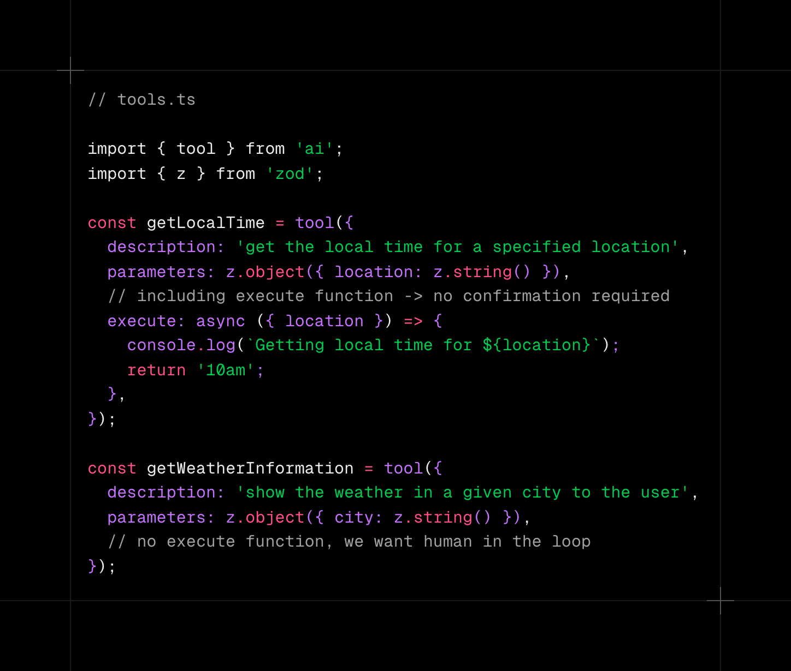

## 시작하기

.env.local.example 을 .env.local 로 copy 하고 OPENAI_API_KEY, ANTHROPIC_API_KEY 값을 세팅해야 합니다.

```bash
cp .env.local.example .env.local
```

gemini-2.0-flash-exp 모델을 사용하려면  GOOGLE_GENERATIVE_AI_API_KEY 가 정의되어야 합니다.

'Thinking...'에니매이션 데모를 찾아오신 분들은 page.tsx 를 열어 redirect('/use-chat-streamdata-multistep') 구문을 활성화 합니다.

```bash
pnpm install
pnpm dev

```

## 프로젝트 소개.
1. Human-In-The-Loop.
- Tool Invocation을 진행하기 전에 사용자에게 확인을 받습니다.
- 경로 : use-chat-human-in-the-loop
- Sample PROMPT : '5만원 보내드려'.

2. Streaming multi-step agent workflows
- Tool Invocation의 결과를 stream 으로 UI 전달. useChat status를 이용하여 'Thinking...' animation 제공. 
- 사용자질의 의도를 파악하는 tool 제공.
- 경로 : use-chat-streamdata-multistep
- Sample PROMPT : '미국 연준이 기준금리를 올린 이후로 글로벌 금융시장이 흔들리는 것 같은데, 단순히 금리가 높아져서 그런 건 아닌 것 같아. 예를 들어, 채권 시장에서 장기 금리는 생각보다 덜 오르고 있고, 주식시장에서는 일부 기술주는 오히려 반등하는 움직임이 보여. 이런 현상이 단순한 유동성 축소 때문인지, 아니면 시장이 어떤 기대를 반영하는 건지 알고 싶어. 특히, 금리 정책이 실물 경제와 자산 가격에 미치는 영향을 더 깊이 이해하려면 어떤 지표를 봐야 할까?'.

3. gemini-2.0-flash-exp 이용 TEXT, IMAGE 질의.
- LangChain 의 checkpoint와 같은기능을 하는 step 별 file 생성.
- 경로 : use-chat-persistence-single-message-image-output
- Sample PROMPT : '내 강아지가 AI 기술을 배우고 싶어한다. 수업 첫날 강아지는 노트북 앞에 앉아 선글라스를 쓰고 진지한 표정으로 코딩을 한다'.

4. MCP transport: stdio Client & Server
- Client transport for stdio: this will connect to a server by spawning a process and communicating with it over stdin/stdout.
- 경로 : use-chat-mcp-mem
- Sample PROMPT :  'I did .... today'. 'what did I do today ?'

4-2. MCP transport:sse Client & Server
- The SSE can be configured using a simple object with a type and url property:
- 경로 : use-chat-mcp-sse
- Sample PROMPT :  'List all products, then find availability for Product 1.


5. Server Action with gemini-2.0-flash-lite
- gemini-2.0-flash-lite 모델의 Story 생성능력 데모
- 경로 : server-action-gemini-2.0-flash-lite
- Sample PROMPT :  'CHAE 와 SUH 는 오로라 여행중. A,B,C ...H 까지 각 철자로 시작하는 문장 8개를 생성해줘'.


6. Visual Reasoning Chat with Llama 4 Scout
- llama-4-scout-17b-16e-instruct 모델의 Visual Reasoning 능력 데모
- 경로 : use-chat-vision
- Sample dataset :  https://lora-vqa.github.io/
- GROQ_API_KEY 등록이 필요합니다 https://console.groq.com/keys


7. Multiple images Visual Reasoning Chat with Llama 4 Scout
- llama-4-scout-17b-16e-instruct 모델의 Visual Reasoning 능력 데모
- 최대 2개 이미지를 지원하고 썸네일과 모달 기능을 추가하는 구현
- 경로 : use-chat-images-vision
- Sample dataset :  https://lora-vqa.github.io/
- GROQ_API_KEY 등록이 필요합니다 https://console.groq.com/keys


8. Multiple images Visual Reasoning Chat with Llama 4 Scout
- grok-2-image 모델의 Image 생성 능력 데모
- 경로 : use-chat-xai-image
- Sample PROMPT : "나를 그려줘"
- GXAI_API_KEY 등록이 필요합니다 https://console.x.ai/


Open [http://localhost:3000](http://localhost:3000) with your browser to see the result.

You can start editing the page by modifying `app/page.tsx`. The page auto-updates as you edit the file.


This project uses [`next/font`](https://nextjs.org/docs/app/building-your-application/optimizing/fonts) to automatically optimize and load [Geist](https://vercel.com/font), a new font family for Vercel.

## Learn More

To learn more about Next.js, take a look at the following resources:

- [Next.js Documentation](https://nextjs.org/docs) - learn about Next.js features and API.
- [Learn Next.js](https://nextjs.org/learn) - an interactive Next.js tutorial.

You can check out [the Next.js GitHub repository](https://github.com/vercel/next.js) - your feedback and contributions are welcome!

## Deploy on Vercel

The easiest way to deploy your Next.js app is to use the [Vercel Platform](https://vercel.com/new?utm_medium=default-template&filter=next.js&utm_source=create-next-app&utm_campaign=create-next-app-readme) from the creators of Next.js.

Check out our [Next.js deployment documentation](https://nextjs.org/docs/app/building-your-application/deploying) for more details.
